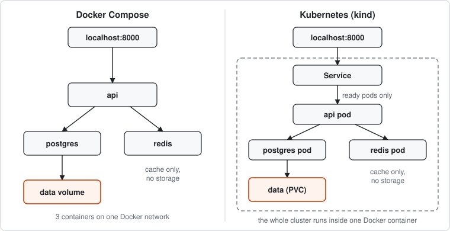
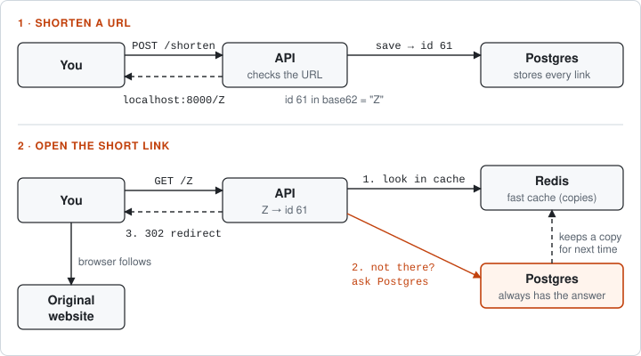
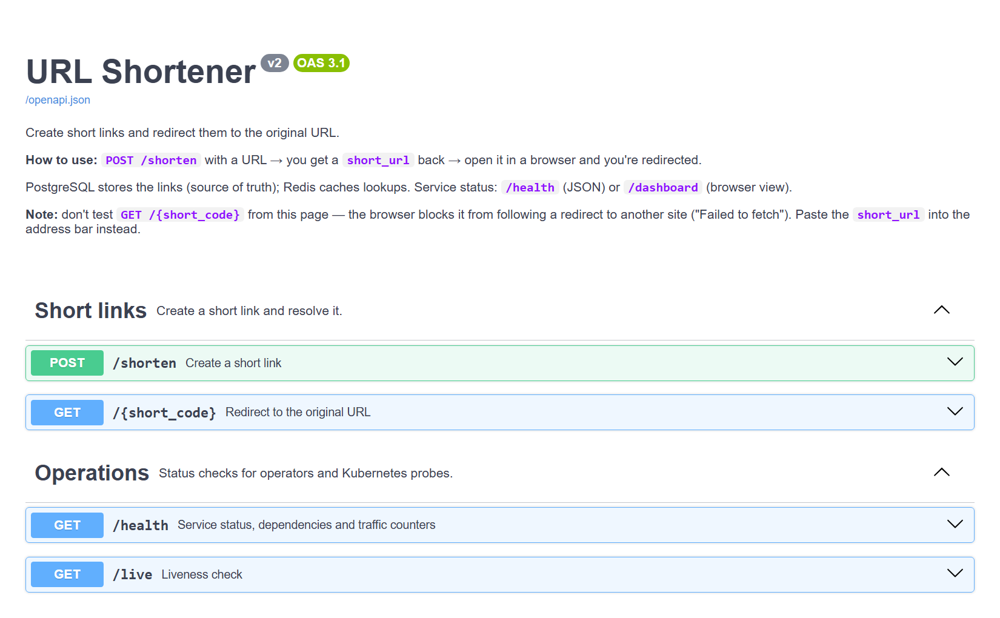
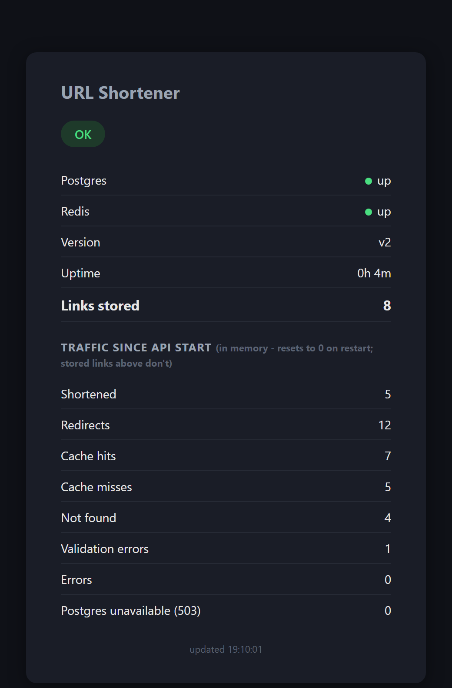
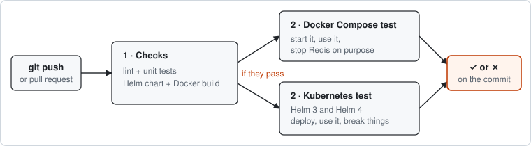

# URL Shortener - DevOps Practical Assignment

[](https://github.com/ilaycohen12/URL-short/actions/workflows/ci.yml)

A small URL shortener: an API that creates short links and redirects them, backed by
PostgreSQL (source of truth) and Redis (cache). The same app is deployed two independent
ways - Docker Compose (Part 1) and Kubernetes via Helm (Part 2) - with operational
visibility and a runbook on top (Part 3).


| Path | What's there |
|---|---|
| `api/` | FastAPI app + Dockerfile |
| `docker-compose.yml`, `.env.example` | Part 1 |
| `helm/url-short/` | Part 2 Helm chart - `values.yaml` is the single source of truth |
| `k8s/kind-cluster.yaml` | Local kind cluster config (maps the API to `localhost:8000`) |
| `scripts/` | One-command Kubernetes setup / stop / teardown / drift check / smoke test (`.sh` + PowerShell `.ps1`) |

```text
URL-short/
├── .github/workflows/
│   └── ci.yml                 # CI: lint, tests, chart, build, end-to-end on kind
├── api/
│   ├── app/
│   │   ├── main.py            # FastAPI app: routes, metrics, exception handlers
│   │   ├── schemas.py         # request/response models + URL validation
│   │   ├── models.py          # SQLAlchemy table (url_mappings)
│   │   ├── db.py              # Postgres connection/session
│   │   ├── cache.py           # Redis client
│   │   ├── config.py          # settings from environment variables
│   │   ├── shortcode.py       # base62 encode/decode
│   │   └── dashboard.py       # /dashboard HTML page
│   ├── tests/                 # unit tests (pytest) - not copied into the image
│   ├── Dockerfile
│   ├── requirements.txt
│   ├── requirements-dev.txt   # + pytest, ruff (CI / local dev only)
│   ├── pyproject.toml         # ruff + pytest settings
│   └── .dockerignore
├── helm/url-short/
│   ├── Chart.yaml
│   ├── values.yaml            # single source of truth for the Kubernetes deployment
│   └── templates/             # api / postgres / redis Deployments + Services,
│                              # postgres PVC, ConfigMap, Secret
├── k8s/
│   └── kind-cluster.yaml
├── scripts/
│   ├── setup-k8s.sh / .ps1       # create (or restart) the cluster + deploy
│   ├── stop-k8s.sh / .ps1        # stop the cluster, keep data
│   ├── check-drift.sh / .ps1     # does the cluster still match git?
│   ├── smoke-test.sh / .ps1      # end-to-end check of a running deployment
│   └── teardown-k8s.sh / .ps1    # delete the cluster and all data
├── docker-compose.yml
├── .env.example
└── README.md
```

---

## Quick start

Compose and Kubernetes are **two independent ways to run the same app**. Both serve the API on `localhost:8000`, so **run only one at a time**.



**1. Start it** (pick one):

| | Docker Compose (Part 1) | Kubernetes (Part 2) |
|---|---|---|
| Needs | Docker with Compose | Docker, `kind`, `kubectl`, `helm` (v3 or v4) |
| Start - Linux / macOS / Git Bash | `docker compose up --build` | `bash scripts/setup-k8s.sh` |
| Start - Windows PowerShell | `docker compose up --build` | `.\scripts\setup-k8s.ps1` |
| Stop, keep data - Linux / macOS / Git Bash | `docker compose down` | `bash scripts/stop-k8s.sh` |
| Stop, keep data - Windows PowerShell | `docker compose down` | `.\scripts\stop-k8s.ps1` |
| Full reset (delete all data) - Linux / macOS / Git Bash | `docker compose down -v` | `bash scripts/teardown-k8s.sh` |
| Full reset (delete all data) - Windows PowerShell | `docker compose down -v` | `.\scripts\teardown-k8s.ps1` |

**2. Shorten a URL** - pick whichever is easiest:

*Option A - in the browser, no terminal needed:*
1. Open http://localhost:8000/docs
2. Click **`POST /shorten`** → **Try it out**
3. Replace the example URL in the body with your own, keeping the quotes:
   `{"url": "https://www.google.com"}`
4. Click **Execute** → scroll to **Response body**

*Option B - Windows PowerShell:*
```powershell
Invoke-RestMethod -Uri "http://localhost:8000/shorten" -Method Post -ContentType "application/json" -Body '{"url":"https://www.google.com"}'
```

*Option C - bash / Git Bash / macOS / Linux:*
```bash
curl http://localhost:8000/shorten --json '{"url":"https://www.google.com"}'
```

Either way you get back a short link:
```json
{"short_code": "1", "short_url": "http://localhost:8000/1"}
```
The URL must start with `http://` or `https://` - anything else is rejected with `422`.

**3. Open the `short_url`** (e.g. http://localhost:8000/1) in a browser → it redirects to the
original URL. (Use the browser's address bar for this, not the `/docs` page - see
[Using the API](#using-the-api).)

**4. Check it's healthy** → http://localhost:8000/health (JSON) or
http://localhost:8000/dashboard (same data, auto-refreshing). Explained in
[Part 3](#part-3---operate-and-troubleshoot).

---

## Using the API

| Endpoint | Description |
|---|---|
| `POST /shorten` | Body: `{"url": "https://..."}` (max 2048 chars). Returns `{"short_code", "short_url"}`. |
| `GET /{short_code}` | Redirects (HTTP 302) to the original URL. 404 if not found. |
| `GET /health` | Status, dependencies, version, uptime, traffic counters - see Part 3. |
| `GET /dashboard` | Browser view of `/health`, auto-refreshing - see Part 3. |
| `GET /live` | Bare liveness check, no dependency calls (used by Kubernetes). |
| `GET /docs` | Interactive, click-to-try API page (auto-generated by FastAPI). |

**How a request flows:**



Postgres is the source of truth; Redis only holds copies (cache-aside). If Redis is down,
requests still work from Postgres, just slower. If Postgres is down, creating links and
uncached lookups fail fast (within 3s) with `503 Database temporarily unavailable`, and
`/health` returns `503` so Kubernetes stops routing to the pod.

**Command-line examples** (same for Compose and Kubernetes; shortening is in the
[Quick start](#quick-start)):
```bash
# bash / Git Bash / macOS / Linux
curl -L http://localhost:8000/1          # follow a short link (-L = follow the redirect)
curl http://localhost:8000/health        # service status
```
```powershell
# Windows PowerShell
Invoke-WebRequest -Uri "http://localhost:8000/1"         # follows the redirect automatically
Invoke-RestMethod -Uri "http://localhost:8000/health"    # service status
```

**`/docs`** - the click-to-try page from the Quick start. Besides the response, it shows the
equivalent `curl` command and the status code for each call. It's generated from the code (routes +
Pydantic models), so it can't go out of date. Don't test redirects there - the browser blocks the
page from following a 302 to an external site ("Failed to fetch"); paste the short URL into the
address bar instead.



---

## Part 1 - Docker Compose

**Run:**
```bash
docker compose up --build     # builds the API image, starts Postgres + Redis + API
```
Works on a clean clone as-is: every setting in `docker-compose.yml` has a fallback
(`${POSTGRES_PASSWORD:-changeme}`) matching `.env.example`. To use your own values,
`cp .env.example .env` and edit it - `.env` (gitignored) always wins over the fallbacks.
The API waits for Postgres/Redis to report healthy before starting.

**Stop:**
```bash
docker compose down          # keeps the Postgres data volume
docker compose down -v       # also wipes it (full reset)
```

**Verify persistence:** create a short URL → `docker compose down` (no `-v`) →
`docker compose up -d` → the same code still resolves. The data lives in the `postgres_data`
volume, independent of the containers.

**Design notes:**
- Postgres/Redis health is checked two ways: Compose's `depends_on: condition: service_healthy`
  (gates when the API container *starts*) plus the API's own retry loop (handles a dependency
  going down *after* startup, which Compose's check can't).
- Short codes are base62-encoded Postgres row ids, not random strings - deterministic, no
  collision handling needed, and no `short_code` column is stored (derived on every request).
- **No deduplication, by choice:** the same URL shortened twice gets two different codes. Each
  request is one simple `INSERT`, and every link can later have its own owner or stats.

---

## Part 2 - Kubernetes

Local cluster only (`kind`) - no cloud account needed. Docker Desktop must be running.

**Run - one command** (safe to rerun: skips cluster creation if it exists, upgrades the release):
```bash
bash scripts/setup-k8s.sh          # Linux / macOS / Git Bash
.\scripts\setup-k8s.ps1            # Windows PowerShell
```
> **Windows:** don't run `bash scripts/setup-k8s.sh` from PowerShell. If WSL is installed, `bash`
> there is WSL's Linux bash, which can't see Windows-installed `kind`/`helm`/`kubectl`
> (`kind: command not found`). The `.ps1` wrappers call Git Bash explicitly to avoid this.

**Run - manual steps** (what the script wraps):
```bash
kind create cluster --name url-short --config k8s/kind-cluster.yaml
docker build -t url-short-api:v2 ./api                      # tag must match api.image.tag in values.yaml
kind load docker-image url-short-api:v2 --name url-short    # kind has its own image store - do this for every tag you use
helm install url-short ./helm/url-short
```

**Stop - two options** (same idea as Compose's `down` vs `down -v`):
```bash
# Stop, KEEP the data - short links are still there after the next setup-k8s:
bash scripts/stop-k8s.sh           # PowerShell: .\scripts\stop-k8s.ps1
# (manually: docker stop url-short-control-plane)

# Full reset, DELETE everything - the next setup-k8s starts from an empty database:
bash scripts/teardown-k8s.sh       # PowerShell: .\scripts\teardown-k8s.ps1
# (manually: helm uninstall url-short && kind delete cluster --name url-short)
```
A kind cluster is a single Docker container (`url-short-control-plane`), and the Postgres PVC is
stored on that container's disk. `stop` just stops the container, so the disk - and the data -
stays; `setup-k8s` detects the stopped cluster and starts it again instead of creating a new
one. `teardown` deletes the container, and the data goes with it. (Note: `helm uninstall` alone
also deletes the data - the PVC is part of the chart.)

**Credentials** live in `helm/url-short/values.yaml` (default `changeme`, same placeholder
pattern as `.env.example`). For a real password: create a gitignored
`helm/url-short/values.secret.yaml` and pass it with `-f` at install time, or
`--set postgres.password=...`.

**Verify persistence / self-healing:**
```bash
kubectl delete pod -l app=postgres    # kill it outright
kubectl get pods -l app=postgres -w   # the Deployment recreates it automatically
curl -L http://localhost:8000/<code>  # still resolves - the data survived on the PVC
```

**Rollout and rollback - through git:** `helm/url-short/values.yaml` in git is the source of
truth. Every change, including a rollback, is made in the file first; the cluster follows it.
```bash
# Roll out a new version:
#   edit helm/url-short/values.yaml (api.image.tag: v3), commit, then:
bash scripts/setup-k8s.sh                 # PowerShell: .\scripts\setup-k8s.ps1

# Roll back = undo the commit, then deploy again:
git revert <commit-that-bumped-the-tag>   # values.yaml goes back, as a new commit with a reason
bash scripts/setup-k8s.sh

# Check the cluster still matches git:
bash scripts/check-drift.sh               # PowerShell: .\scripts\check-drift.ps1
```
**Don't use `helm rollback` or `helm upgrade --set`** - they change the cluster without changing
the file, so git and the cluster silently disagree ("drift"), and the next deploy from git
re-releases the version you rolled back from.

**`check-drift`** catches it when something went around git anyway. Exit `0` = no drift,
`1` = drift (with the exact difference shown), `2` = couldn't check. Two checks:
1. **Helm's last deploy vs git** (`helm get manifest` vs `helm template`) - catches
   `helm rollback` and `helm upgrade --set`.
2. **Live cluster vs git** (`kubectl diff`) - catches changes that bypass Helm completely
   (`kubectl set image` / `edit` / `scale` / `rollout undo`), which check 1 can't see.

To fix drift, make git say what you want and run `setup-k8s` - it overwrites manual changes.
Two flags make that work: `--reset-values` (Helm remembers values from an earlier
`helm upgrade --set` and would otherwise reuse them) and `--force-conflicts` (Helm 4 otherwise
refuses to overwrite a field someone changed with `kubectl`).

**Design notes:**
- **Helm**, not plain manifests/Kustomize (all three allowed). Built and fully tested as plain
  YAML first, then converted - `values.yaml` is now the single source of truth, so e.g. the
  Postgres Service name and the ConfigMap's `POSTGRES_HOST` can't drift apart (both read
  `.Values.postgres.name`).
- **Postgres**: Deployment + `strategy: Recreate` (not the default `RollingUpdate` - a
  `ReadWriteOnce` PVC can't be mounted by two pods at once) + PVC. Not a StatefulSet - single
  instance, no replication to justify one.
- **Redis**: plain Deployment, no PVC (losing cache data on restart is correct, not a gap), no
  auth (local-only scope). **Optional at runtime**: if Redis is down, lookups fall back to
  Postgres (1s timeout) and the API keeps serving - a cache outage makes it slower, not
  unavailable. The API also starts without it.
- **API probes**: `readinessProbe` → `/health`, which returns `503` only when **Postgres** is down
  (verified live: pulls the pod out of the Service's routing during a real Postgres outage, and
  keeps it in during a Redis outage). `livenessProbe` → `/live` instead, deliberately -
  tying liveness to dependency health would make Kubernetes restart a healthy pod during a
  Postgres outage, which can't fix Postgres and only adds churn. **`startupProbe`** → `/live`,
  up to 150s: the API only starts serving once Postgres is reachable, and after a cluster restart
  that can take ~30–60s (cluster DNS comes up late). Without it, liveness killed the API
  mid-startup; with it, liveness only begins once the API has started.
- **Host access**: `NodePort`, not `port-forward` - keeps working without an open terminal.
- **Resources**: API/Postgres `100m–500m` CPU, `128–256Mi` memory; Redis lighter (`50m–200m`,
  `64–128Mi`) since it does less work per request. Local-demo starting points, not load-tested.
- **Rollback drift - handled by process + detection, not enforcement**: rolling back through git
  (above) keeps the file and cluster in sync, and `check-drift` detects anything that went around
  it. Nothing *prevents* someone from running `helm rollback` by hand - enforcing that is what a
  GitOps controller (ArgoCD/Flux) adds: it watches the repo and reverts manual changes
  automatically. Out of scope for a local assignment. (Why not a script that rolls back and then
  copies the cluster's values into `values.yaml`? That makes the cluster the source of truth -
  backwards - and `helm get values` only returns overrides, not the full config.)

---

## Part 3 - Operate and troubleshoot

### Visibility

**`/health`** - one endpoint answers "is it up, what version, is it getting traffic":
```json
{
  "status": "ok",
  "postgres": true,
  "redis": true,
  "version": "v2",
  "uptime_seconds": 12.0,
  "links_stored": 76,
  "metrics": {
    "shorten_requests": 6, "redirects": 6, "cache_hits": 2, "cache_misses": 4, "not_found": 1,
    "validation_errors": 0, "errors": 0, "db_unavailable": 0
  }
}
```
- **Postgres unreachable** → HTTP **`503`**, `"status": "degraded"`. The API can't work without
  it; probes and monitoring tools look at status codes, not JSON bodies, so this is what makes
  Kubernetes stop routing traffic to the pod.
- **Always answers fast** - each dependency check has a 2s limit (below the readiness probe's
  3s timeout) and Postgres connections give up after 3s, so `/health` never hangs during an
  outage (before this, an unreachable Postgres on Kubernetes could make it take up to 60s).
- **Only Redis unreachable** → HTTP **`200`**, `"status": "degraded"`, `"redis": false`. Requests
  are still served from Postgres (just without the cache), so the pod stays in service - on-call
  still sees the problem in the body and in the logs (`Redis unavailable, reading from Postgres`).
- **`/live`** is a separate, dependency-free check used for the liveness probe - see Part 2's
  "API probes" note for why the two are split.

- **`links_stored`** - how many links exist, counted in Postgres. Unlike the traffic counters
  below it survives restarts (`null` when Postgres is unreachable).

**`/dashboard`** - open http://localhost:8000/dashboard in a browser: the same data as `/health`,
styled and auto-refreshing every 3 seconds. Easier to glance at during an incident or a demo.
**Links stored** is at the top; the counters below it are labelled *Traffic since API start* -
after any restart they show 0 while your links are still there.



**Metrics** - what each counter means:

| Counter | Dashboard label | Counts |
|---|---|---|
| `shorten_requests` | Shortened | Successful `POST /shorten` - short links created |
| `redirects` | Redirects | Successful redirects (someone opened a valid short link) |
| `cache_hits` | Cache hits | Redirects answered from Redis - no Postgres query |
| `cache_misses` | Cache misses | Redirects not in Redis → looked up in Postgres, then written to Redis |
| `not_found` | Not found | Requests for a short code that doesn't exist (404) |
| `validation_errors` | Validation errors | Bad input rejected with `422` - the *client* sent something wrong |
| `errors` | Errors | Unhandled `500`s - a bug on *our* side; should always be 0 |
| `db_unavailable` | Postgres unavailable (503) | Requests answered `503` because Postgres couldn't be reached - an outage, not a bug |

How to read them:
- **`redirects` = `cache_hits` + `cache_misses`**, always - every successful redirect is exactly
  one of the two. The first open of a link is a miss (Postgres, then cached); repeats are hits.
- A lookup that isn't in Postgres either counts as `not_found`, not as a miss.
- **`validation_errors` vs `errors` vs `db_unavailable`** tells you whose problem a spike is:
  clients sending bad data, our code failing, or the database being unreachable.
- `not_found` often ticks up by itself from browsers requesting `/favicon.ico`.
- **Limits:** counters live in the API process's memory - they reset to 0 when the pod restarts
  (including after a rollout/rollback or `stop-k8s` + `setup-k8s`), and each replica counts
  separately (we run 1). A 0 here does **not** mean data was lost - check `links_stored`.

**Logs** - for the actual traceback behind an error:
`kubectl logs -l app=api` (Kubernetes) or `docker compose logs api` (Compose).

### Runbook

Each entry below was tested by causing the failure for real, not written from assumption.

**1. The API is running but requests fail**
- Check `/health` first. `postgres: false` → not this, go to #2. `redis: false` → the cache is
  down: requests still work (from Postgres) but slower; check `kubectl get pods -l app=redis` /
  `docker compose ps redis` and its logs.
- `/health` says `ok` but requests still fail → app-level bug. Check `errors` in the metrics, then
  the logs for a traceback.
- *Real example hit during development:* a 2049–2083 char URL passed Pydantic's validation but
  exceeded the DB column's 2048-char limit → raw `500` while `/health` stayed fully healthy. Log
  showed `StringDataRightTruncationError: value too long for type character varying(2048)`. Fixed
  by validating length at the API boundary.
- *Verify recovery:* retry the request, confirm success; confirm `/health` stayed `ok` throughout.

**2. The API cannot connect to PostgreSQL**
- **Confirm it's Postgres:** `/health` shows `"postgres": false` (HTTP 503). Requests fail fast
  with `503 Database temporarily unavailable`, counted in `db_unavailable`.
  - **On Kubernetes, after ~15s `localhost:8000` stops answering at all**: the readiness probe
    has taken the API pod out of the Service, so the NodePort has nowhere to send you. Reach the
    pod directly instead (skips the Service, works even when the pod isn't ready):
    `kubectl port-forward deploy/api 18000:8000`, then `curl localhost:18000/health`.
- **Is Postgres running?** `kubectl get deploy postgres` + `kubectl get pods -l app=postgres` /
  `docker compose ps postgres`.
  - Deployment shows `0/0` → it was scaled to zero. Fix: `kubectl scale deploy/postgres --replicas=1`
    (Compose: `docker compose start postgres`).
  - Pod crashing or restarting → next step.
- **Why is it failing?** `kubectl logs -l app=postgres` (add `--previous` after a crash) /
  `docker compose logs postgres`. A pod stuck in `Pending` usually means storage:
  `kubectl get pvc postgres-pvc` should say `Bound`.
- **Can the API find it?** `kubectl get endpointslices -l kubernetes.io/service-name=postgres` -
  no address under ENDPOINTS means the Service has no ready Postgres pod behind it.
- **Postgres is up but the API still can't log in?** Postgres applies `POSTGRES_USER`/`PASSWORD`
  only when it first creates its data, so a password changed later in the Secret is ignored.
  Fix: set the same password inside Postgres -
  `kubectl exec deploy/postgres -- psql -U urlshortener -c "ALTER USER urlshortener PASSWORD '<new>'"`
  (Compose: `docker compose exec postgres psql ...`) - or wipe the data (`teardown-k8s`) if it's
  disposable.
- *Live-tested:* scaled Postgres to 0 - `/health` answered 503 immediately, after ~15s the API pod
  was `0/1` and `localhost:8000` unreachable, while `port-forward` still showed `"postgres": false`.
- *Verify recovery:* `/health` → `"postgres": true` and the API pod back to `1/1`, then create a
  link and open it - a real request, not just the flag.

**3. A Kubernetes pod is running but receives no traffic**
- `kubectl get pods` - `READY: 0/1` (container running, probe failing) is the signature.
- `kubectl describe pod` - the Events section names the specific probe failure.
- `kubectl get endpoints <service>` - confirms the pod's IP is genuinely missing from routing
  (this is Kubernetes correctly protecting traffic - the goal is finding *why* it's not ready).
- Root causes branch from there: dependency down (→ #2), crash-looping
  (`kubectl logs --previous`), misconfigured probe, or `OOMKilled`.
- *Live-tested, real captured event:*
  `Readiness probe failed: HTTP probe failed with statuscode: 503` - `kubectl get endpoints`
  showed no endpoints while unready, `RESTARTS` stayed `0` throughout (readiness and liveness
  reacting independently, as designed).
- *Verify recovery:* pod back to `1/1`, endpoint reappears, a request through the Service
  succeeds.

---

## CI

GitHub Actions (`.github/workflows/ci.yml`) runs on every push to `master` and every pull request -
on GitHub's servers, nothing to run locally. Result: ✅/❌ next to each commit, logs in the
**Actions** tab.



| Job | What it does | Time |
|---|---|---|
| **Lint, unit tests, chart, image build** | `ruff` lint + format check · `pytest` (base62 codes, URL validation incl. the 2048-char regression, Redis-failure fallback, 503 on Postgres outage, fast `/health`) · `helm lint` + `helm template` · `docker build` | ~40s |
| **Docker Compose on a clean checkout** | The brief's exact `docker compose up --build` with **no `.env`** → `smoke-test.sh` → Redis outage (links still redirect) | ~1 min |
| **End-to-end on kind** (runs twice: Helm 3 and Helm 4) | Creates a real kind cluster with `scripts/setup-k8s.sh` → `smoke-test.sh` (shorten, redirect, cache hit, 404, 422, /health) → `check-drift.sh` → Redis outage (API must stay ready, links still redirect) → Postgres outage (fast `503`s, recovers) → creates a link, `stop-k8s` + `setup-k8s`, confirms it still resolves, `links_stored` survived and no liveness kill | ~2 min |

The Compose and Kubernetes jobs only start if the first one passes, and they use the **same scripts a tester
runs** - so CI also proves the README's instructions work. On failure it prints pod status and
logs. Verified it catches real bugs: changing the URL length check from `>` to `>=` turned the
run red (`test_url_at_max_length_is_accepted FAILED`) and skipped the end-to-end job.

**Run the same checks locally:**
```bash
cd api
pip install -r requirements-dev.txt
ruff check . && ruff format --check .   # lint
pytest                                  # unit tests
cd ..
bash scripts/smoke-test.sh              # against a running deployment (PowerShell: .\scripts\smoke-test.ps1)
```

---

## Documentation

What I did, in order.

**Day 1: build it**
1. Chose the stack (Python + FastAPI, Postgres, Redis) and designed the endpoints.
2. Wrote the API: settings, database, cache, base62 short codes, input validation and `/health`.
3. Ran it locally against throwaway Postgres and Redis containers and fixed the first bugs.
4. Part 1: wrote the Dockerfile and `docker-compose.yml` with healthchecks, a data volume and
   `.env.example`, then tested a clean start and a restart.
5. Part 2: created a kind cluster and deployed step by step: config and secret, Postgres with
   storage, Redis, then the API with probes, resources and host access.
6. Rolled out a new version and rolled it back, and noticed the rollback left the files out of
   sync with the cluster.
7. Part 3: added version, uptime and traffic counters to `/health`, and wrote the runbook by
   causing each failure for real.
8. Converted the Kubernetes files to a Helm chart, added setup and teardown scripts and the
   `/dashboard` page, and rewrote the README.

**Day 2: make it solid**
1. Made the scripts work from Windows PowerShell and added a "stop but keep the data" option.
2. Reorganised the README and made the `/docs` page readable.
3. Fixed the rollback problem: rollbacks now go through git, and `check-drift` catches anything
   that went around it.
4. Added CI with GitHub Actions: lint, unit tests, and full Compose and Kubernetes tests on
   every push.
5. Tested it all as a single product.

---

## Tools used

| Tool | Version | Why this one |
|---|---|---|
| Python + **FastAPI** | 3.13 / 0.115 | Async, small, validation built in (Pydantic), generates `/docs` for free |
| SQLAlchemy (async) + asyncpg | 2.0 / 0.30 | Standard async Postgres access; creates the table on startup (one table, no migration tool needed) |
| redis-py | 5.0 | Async Redis client, with timeouts so a dead cache fails fast |
| **PostgreSQL** | 16 | Source of truth for links |
| **Redis** | 7 | Cache for lookups |
| **Docker / Docker Compose** | 28 / 2.40 | Part 1; healthchecks gate startup order |
| **kind** | 0.33 (Kubernetes 1.37) | Part 2 local cluster: runs in Docker (no VM), same Docker already needed for Part 1, reproducible in CI |
| **Helm** | 3 or 4 (tested on both) | One `values.yaml` as the source of truth; rollout/rollback through git |
| kubectl | 1.34 | Cluster access, `kubectl diff` for drift detection |
| **GitHub Actions** | - | CI: lint, tests, Compose and kind end-to-end on every push |
| ruff / pytest | 0.16 / 9.1 | Lint + formatting / unit tests (dev only, not in the image) |
| Git Bash + PowerShell wrappers | - | Scripts are bash; `.ps1` wrappers make them work from Windows PowerShell |

---

## Decisions

### Assumptions
- **Local only**: no cloud, no managed database, no real users or domain.
  Short URLs use `http://localhost:8000`.
- **Anyone can create links** - no authentication, no rate limiting, no per-user ownership.
- **Single instance of each component** (1 API replica, 1 Postgres, 1 Redis) - enough for a
  demo; nothing is load-tested.
- **Credentials are placeholders** (`changeme`) - real ones would come from a gitignored `.env`
  / `values.secret.yaml` or a secret manager, never from git.
- **Links never expire** and can't be edited or deleted.
- **The reviewer may be on Windows, macOS or Linux** - hence the PowerShell wrappers and
  Helm 3 + 4 support.

### Key decisions
More detail is in each Part's *Design notes*.

| Decision | Why | Rejected alternative |
|---|---|---|
| Short code = Postgres id in **base62** | Unique by construction, no collision checks, short (≤ 6 chars) | Random codes (need collision retries) |
| **No deduplication** of repeated URLs | One simple `INSERT`; matches per-user shortener behaviour | Unique hashed index + `ON CONFLICT` (documented how, if needed) |
| **Redis optional at runtime** | A cache outage should slow the service, not stop it | Redis as a hard dependency (a cache outage became a full outage) |
| `/health` → readiness (503 only if Postgres down), `/live` → liveness | Kubernetes stops routing when the API can't serve, but never restarts a healthy pod because a dependency is down | One endpoint for both probes |
| **Helm**, not plain manifests | One `values.yaml` keeps names/config consistent across templates | Plain YAML (used first, then converted), Kustomize |
| Postgres as Deployment + `Recreate` + PVC | Single instance; RWO volume can't be shared during a rolling update | StatefulSet (no replication to justify it) |
| **NodePort** for host access | Works without a terminal left open | `kubectl port-forward` |
| **Rollback through git** (`git revert` + setup) + `check-drift` | Git stays the source of truth; drift is detectable | `helm rollback` (leaves git out of sync), a script syncing the cluster back into `values.yaml` |
| Visibility via `/health` + `/dashboard` + logs | Answers "is it up, what version, what traffic" with zero extra infrastructure | Prometheus + Grafana (more than the brief asks) |
| `stop-k8s` (keep data) vs `teardown-k8s` (reset) | Mirrors Compose's `down` vs `down -v` | Storing data in a host folder (Postgres permission issues on Windows) |

### AI suggestions: verified, changed, rejected
AI tools (Claude) were used throughout. Every suggestion was tested; these are the ones that
turned out wrong and were changed or rejected:

| Suggestion | What happened | Outcome |
|---|---|---|
| Point the liveness probe at `/health` | Kubernetes would restart a healthy API during a Postgres outage | **Rejected** → separate `/live` |
| `/health` returns 200 with "degraded" in the body | Probes only read the status code, so readiness could never fail | **Changed** → 503 |
| Setup script "verified" | Only tested from Git Bash; from PowerShell it failed | **Changed** → `.ps1` wrappers |
| Roll back by copying the cluster's values into `values.yaml` | Makes the cluster the source of truth instead of git | **Rejected** → rollback through git |
| `docker kill` to test a Postgres crash | Docker doesn't auto-restart a container stopped by hand, so it tested nothing | **Changed** → crash from inside the container |

---

## Known limitations

- **Rollback drift is detected, not prevented** - rollbacks go through git and `check-drift`
  catches manual changes, but nothing blocks a manual `helm rollback`; that needs GitOps
  (ArgoCD/Flux). See Part 2's Design notes.
- **No deduplication** - the same URL shortened twice gets two codes; deliberate, see Part 1's
  Design notes.
- **Guessable short codes** - sequential by design; fine for this scope, not for access control.
- **In-memory metrics** - reset on restart, per replica (Part 3 → Metrics).
- **Redis has no auth** - fine for local-only scope, not for a shared environment.
- **Smaller known gaps** - cached entries never expire (Redis grows without limit - fix: a TTL); leading zeros create
  alias codes (`/1` = `/01`); the runbook's `kubectl get endpoints` is deprecated in favour of
  `kubectl get endpointslices`.
- **CI only, no CD** - every push is checked (see [CI](#ci)), but nothing deploys automatically;
  there's no shared cluster to deploy to. Next steps would be publishing versioned images to a
  registry (e.g. GHCR) and a GitOps controller (ArgoCD/Flux) deploying from git.
